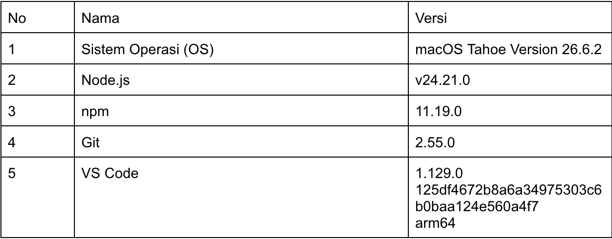
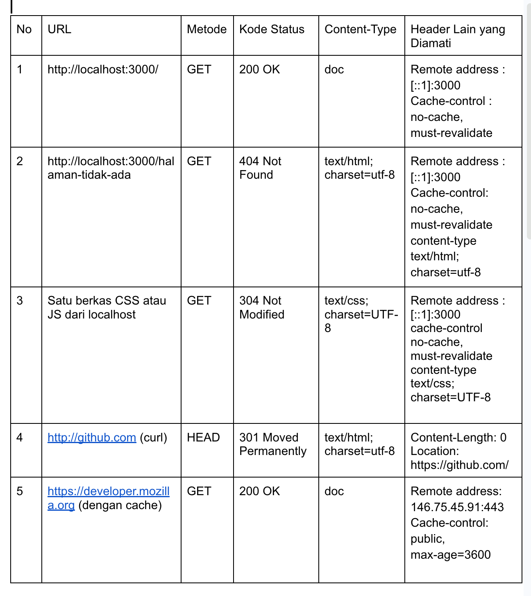

# Dokumen Teknis Modul 1 — Lingkungan Pengembangan, Git, dan Lalu Lintas
Nama/NIM : Michael Alexander Newton
Repositori : https://github.com/Axcelion017/PAW-Praktikum-CS5

## 1. Lingkungan Pengembangan

## 2. Alur Kerja Git
* 452bb0f (HEAD -> Dokumen-Teknis, origin/MikeW1, origin/HEAD, MikeW1) First Push
* ecf8ca0 (main, feat/website-changes) First Push

Penangana konflik adalah dengan melakukan perbaikan pada baris kode yang terkena konflik

## 3. Pengamatan Lalu Lintas HTTP
- Lembar kerja pengamatan (Tabel 9) beserta tangkapan layar DevTools

- Keluaran curl -I dan curl -v
HTTP/1.1 200 OK
Vary: rsc, next-router-state-tree, next-router-prefetch, next-router-segment-prefetch, Accept-Encoding
Link: </_next/static/media/797e433ab948586e-s.p.0r6juujl39pe6.woff2>; rel=preload; as="font"; crossorigin=""; type="font/woff2", </_next/static/media/caa3a2e1cccd8315-s.p.0wgildi0cnwt9.woff2>; rel=preload; as="font"; crossorigin=""; type="font/woff2"
Cache-Control: no-cache, must-revalidate
X-Powered-By: Next.js
Content-Type: text/html; charset=utf-8
Date: Sat, 26 Sep 2026 08:02:03 GMT
Connection: keep-alive
Keep-Alive: timeout=5

HTTP/1.1 301 Moved Permanently
Content-Length: 0
Location: https://github.com/

* Host developer.mozilla.org:443 was resolved.
* IPv6: (none)
* IPv4: 146.75.45.91
*   Trying 146.75.45.91:443...
* Connected to developer.mozilla.org (146.75.45.91) port 443
* ALPN: curl offers h2,http/1.1
* (304) (OUT), TLS handshake, Client hello (1):
*  CAfile: /etc/ssl/cert.pem
*  CApath: none
* (304) (IN), TLS handshake, Server hello (2):
* (304) (IN), TLS handshake, Unknown (8):
* (304) (IN), TLS handshake, Certificate (11):
* (304) (IN), TLS handshake, CERT verify (15):
* (304) (IN), TLS handshake, Finished (20):
* (304) (OUT), TLS handshake, Finished (20):
* SSL connection using TLSv1.3 / AEAD-CHACHA20-POLY1305-SHA256 / [blank] / UNDEF
* ALPN: server accepted h2
* Server certificate:
*  subject: CN=developer.mozilla.org
*  start date: Sep 23 12:49:06 2026 GMT
*  expire date: Dec 22 12:49:05 2026 GMT
*  subjectAltName: host "developer.mozilla.org" matched cert's "developer.mozilla.org"
*  issuer: C=US; O=Let's Encrypt; CN=YR2
*  SSL certificate verify ok.
* using HTTP/2
* [HTTP/2] [1] OPENED stream for https://developer.mozilla.org/
* [HTTP/2] [1] [:method: GET]
* [HTTP/2] [1] [:scheme: https]
* [HTTP/2] [1] [:authority: developer.mozilla.org]
* [HTTP/2] [1] [:path: /]
* [HTTP/2] [1] [user-agent: curl/8.7.1]
* [HTTP/2] [1] [accept: */*]
> GET / HTTP/2
> Host: developer.mozilla.org
> User-Agent: curl/8.7.1
> Accept: */*
> 
* Request completely sent off
< HTTP/2 302 
< content-type: text/plain; charset=utf-8
< location: /en-US/
< x-cloud-trace-context: 1ee683223a06dfaf6c3ee8a8cc824fd1
< cache-control: max-age=3600,public
< via: 1.1 google, 1.1 varnish, 1.1 varnish
< server: Google Frontend
< accept-ranges: bytes
< date: Sat, 26 Sep 2026 08:02:03 GMT
< age: 1396
< x-served-by: cache-sin-wsss1830048-SIN, cache-sin-wsss1830048-SIN, cache-sin-wsss1830056-SIN
< x-cache: MISS, HIT
< x-cache-hits: 0, 1
< x-timer: S1790409724.820220,VS0,VE4
< vary: Accept
< content-length: 29
< 
* Connection #0 to host developer.mozilla.org left intact
Found. Redirecting to /en-US/%                 

- Analisis: perbedaan status dan ukuran antara pemuatan dengan dan tanpa
cache, alasan metode curl -I adalah HEAD, dan alasan http://github.com dialihkan

Perbedaan status dan ukuran antara cache dengan yang tidak itu karena pada saat menggunakan cache, status pada penggunaan cache biasanya 304 (melakukan konfirmasi ke server jika adanya konten yang berubah dari server atau tidak)  atau 200 (dari memory lokal karena terunduh dahulu dan tersimpan di memory lokal), ukuran pada cache cenderung kecil karena hanya perlu melakukan pertukaran header dan tidak perlu melakukan pengunduhan konten lg jika tidak adanya perubahan serta dapat langsung mengambil dari memory lokal. untuk tanpa cache biasanya respon adalah 200 yang berarti file ada di server dan dikirimkan ke peramban, untuk ukuran cenderung lebih besar karena ia harus melakukan unduh konten dari server yang memakan bandwidth dan waktu.

Alasan cURL -I adalah HEAD karena saat perintah ini dijalankan yang terjadi adalah informasi dari pengambilan hanya bagian headersnya saja tanpa perlu mengambil informasi halamannya (body). Hal ini sama kerjanya dengan metode GET hanya saja server web dikonfigurasi untuk hanya membalas dengan metadata (seperti status kode, tanggal, dan tipe konten) tanpa mengirimkan fisik filenya. Hal ini berguna dalam mengecek status URL dengan cepat tanpa harus memboroskan biaya internet.

Alasan utama dari http://github.com diahlikan ke https://github.com karena keamanan dimana spesifikasi https menggunakan library TLS yang berguna dalam mengenkripsi komunikasi dan data antara peramban dengan web sehingga mencegah terjadinya penyadapan oleh pihak ketiga. 

## 4. Kendala dan Penyelesaian
Tidak ada kendala

## 5. Catatan Pemanfaatan AI
Tidak menggunakan AI

