# Dokumen Teknis Modul 2 — HTML Semantik, Tailwind CSS, dan Aksesibilitas
Nama/NIM : Michael Alexander Newton (105224017)
Repositori : https://github.com/Axcelion017/PAW-Praktikum-CS5/tree/main/week-2
## 1. Struktur Semantik
- Kerangka landmark dan hierarki judul halaman utama
header berperan sebagai banner.

nav aria-label="Navigasi utama" berperan sebagai navigation.

main id="konten" berperan sebagai main.

section aria-labelledby="..." berperan sebagai region (karena diberi nama menggunakan aria-labelledby).

aside aria-label="Informasi tambahan" berperan sebagai complementary.

footer berperan sebagai contentinfo.

h1: Kalimat nilai utama produk
    h2: Fitur Utama
        h3: Fitur pertama, Fitur kedua, Fitur ketiga
    h2: Hubungi Kami
    h2: Cara Kerja

- Tangkapan layar pohon aksesibilitas pada DevTools
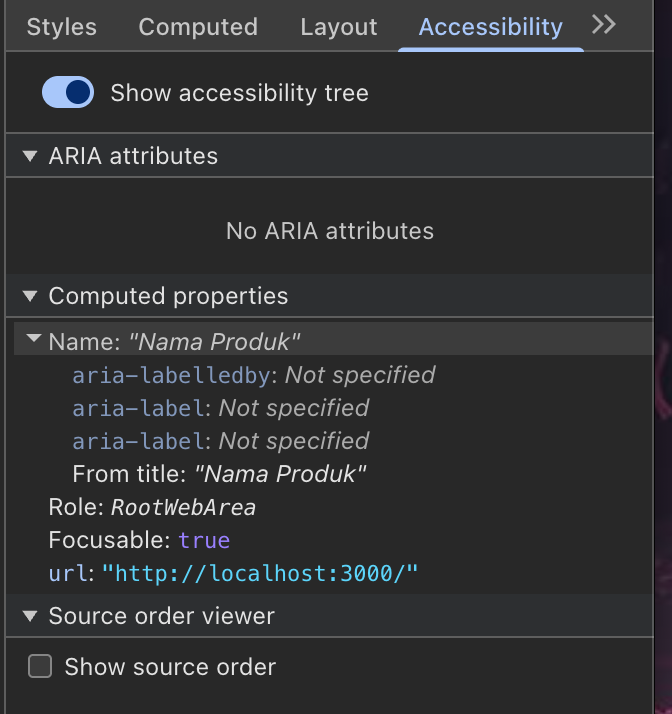

## 2. Tata Letak Responsif
- Tangkapan layar pada lebar 360 px, 768 px, dan 1280 px
360 px:
.png>)
768 px:
.png>)
1280 px:
.png>)
- Kelas Flexbox, Grid, dan breakpoint yang digunakan beserta alasannya

Flexbox: Digunakan pada nav untuk menyusun logo dan menu navigasi. Menggunakan flex-col agar di layar HP (lebar < 640px) elemen disusun menumpuk ke bawah, dan flex-row agar tersusun mendatar di layar yang lebih besar.

Grid: Digunakan pada fitur (ul) dan tata letak utama (div pembungkus section & aside). Grid digunakan agar memudahkan pembagian space berbasis kolom.

Breakpoint: Menerapkan pendekatan mobile-first. Tampilan default dibuat satu kolom untuk HP. sm: (>= 640px) mengubah fitur menjadi 2 kolom, dan lg: (>= 1024px) mengubah fitur menjadi 3 kolom serta membagi layout konten vs aside menjadi rasio 2:1 (lg:grid-cols-[ 2fr_1fr ]).

## 3. Audit Aksesibilitas
- Tabel skor Lighthouse sebelum dan sesudah perbaikan
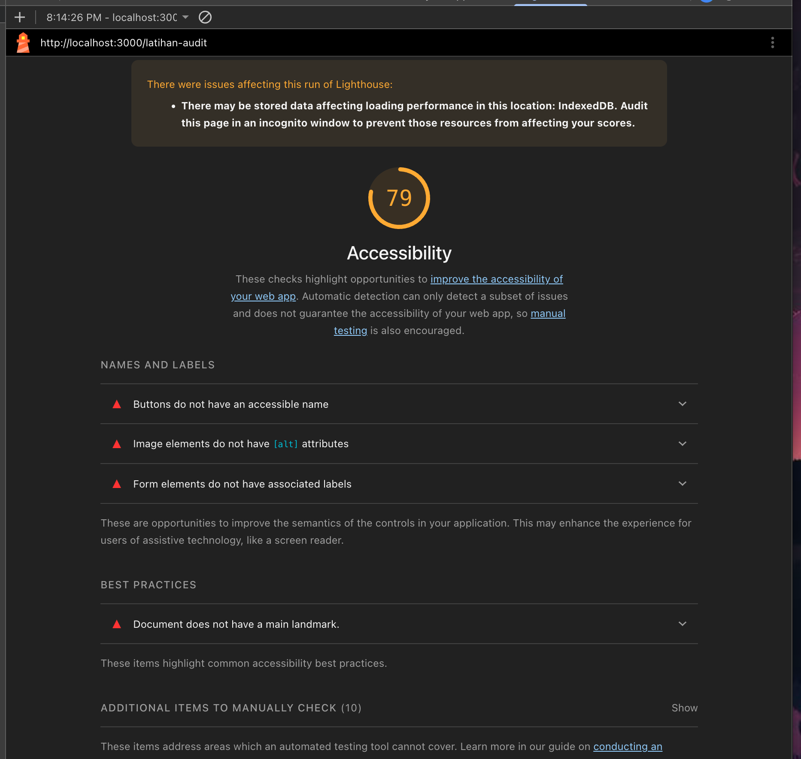
sebelum latihan audit
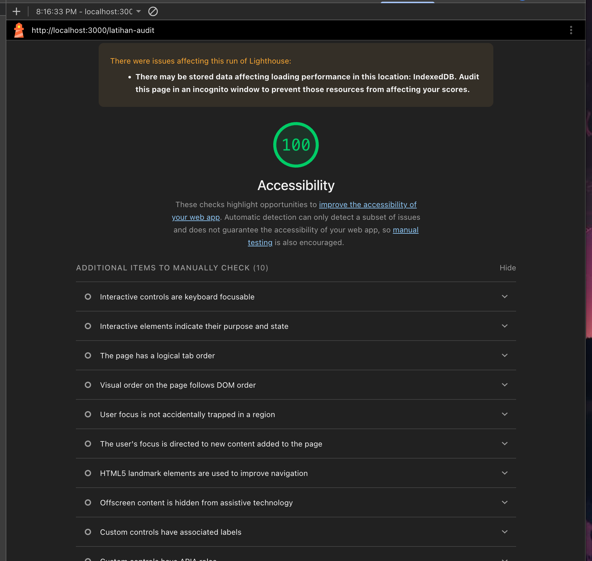
setelah latihan audit
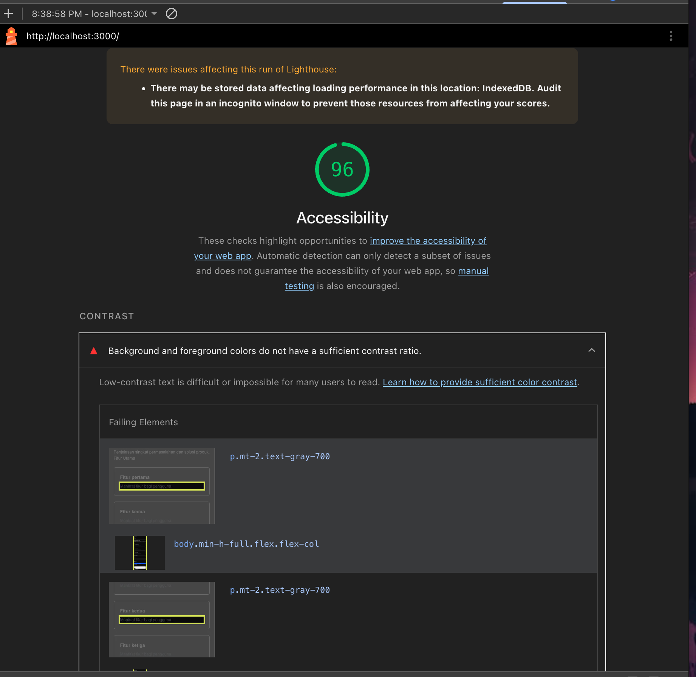
sebelum perbaikan halaman utama
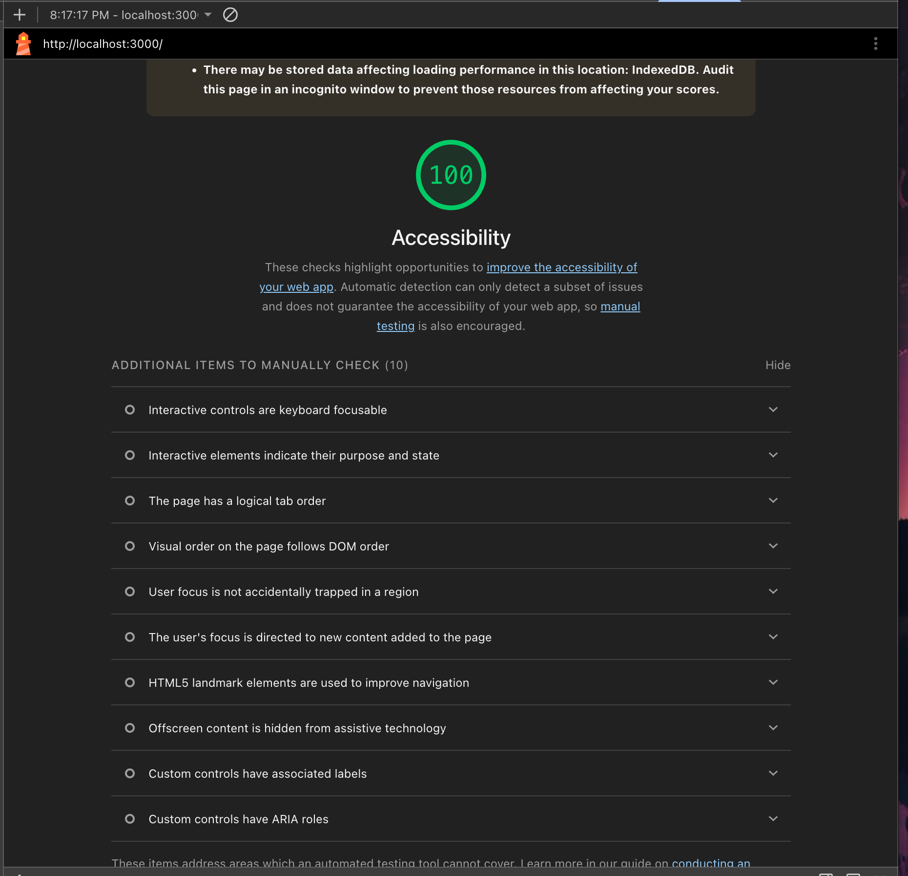
Setelah perbaikan halaman utama 
 (halaman latihan dan halaman utama)

 
- Daftar audit yang gagal, penyebab, dan perbaikannya
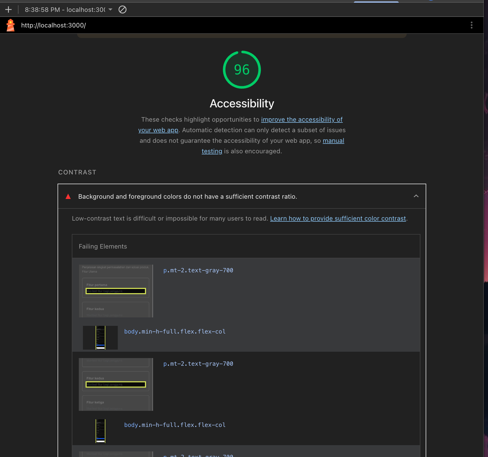

Penyebab: Pada bagian deskripsi fitur dan petunjuk surel, menggunakan kelas Tailwind text-gray-700 dan text-gray-600 di atas latar belakang halaman yang gelap. Tailwind standar tidak memiliki skala tersebut, sehingga warna teks menjadi pudar atau tidak terbaca oleh pengguna dengan gangguan penglihatan.

Perbaikannya: mengganti nama kelas tersebut menjadi text-white-700 dan text-white-600 agar teks menjadi warna putih dan kontrasnya memenuhi standar aksesibilitas minimum (rasio 4,5:1).
- Hasil pemeriksaan manual dengan papan ketik   
Lewati konten utama:
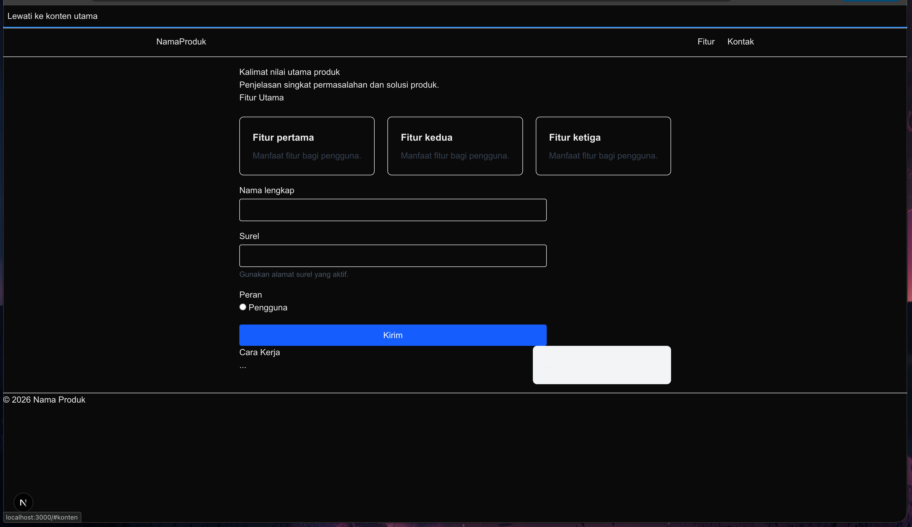
Nama produk:
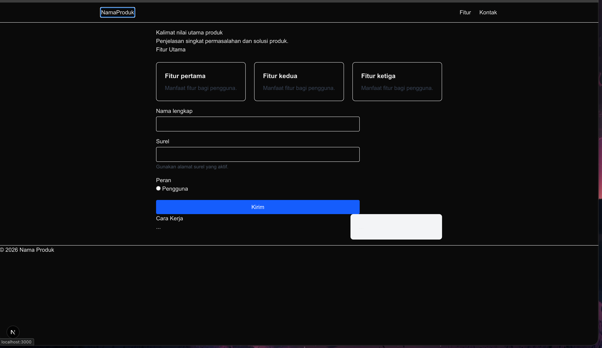
Fitur:
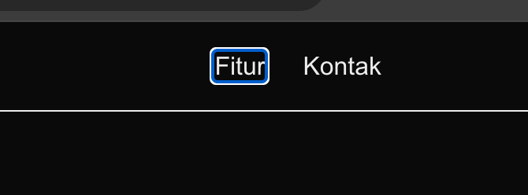
Kontak:
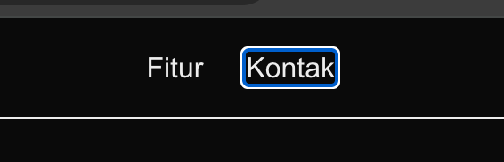
Input nama:
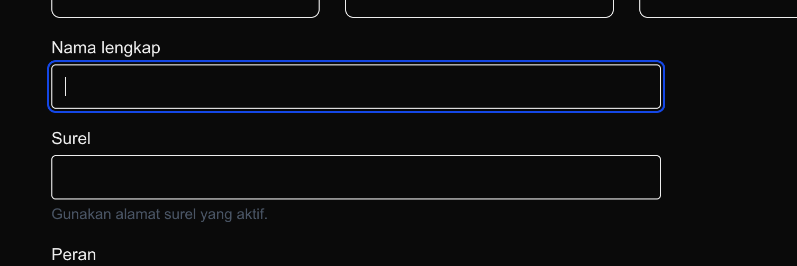
Input surel:
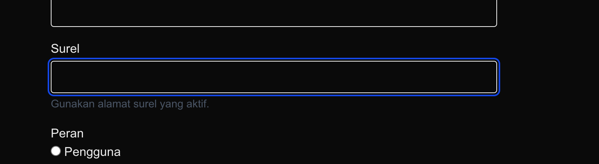
Peran:
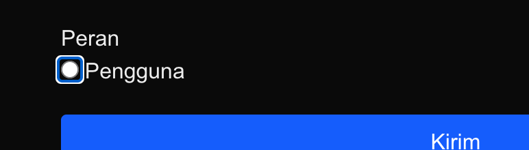
Tombol Kirim:
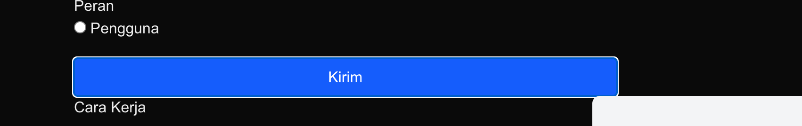
(urutan fokus dan garis fokus)
## 4. Kendala dan Penyelesaian

Tidak ada kendala

## 5. Catatan Pemanfaatan AI
Alat, perintah utama, bagian yang digunakan, dan cara memverifikasinya.
Tulis "Tidak menggunakan AI" apabila tidak menggunakan AI.

Alat: Gemini
Perintah: export default function LatihanAudit() {
 return (
 

 
Katalog Alat Laboratorium

 
 
Stok diperbarui setiap hari.

 <input type="search" className="border p-2" />
 <button className="ml-2 border p-2">
 <svg width="16" height="16" viewBox="0 0 16 16">
 <circle cx="7" cy="7" r="5" stroke="currentColor" fill="none" />
 </svg>
 </button>
 

 );
}

Mungkin bisa perbaiki aksesibilitas yang terjadi akrena saya mendapatkan angka 82, tolong berikan panduan jangan kodenya langsung 

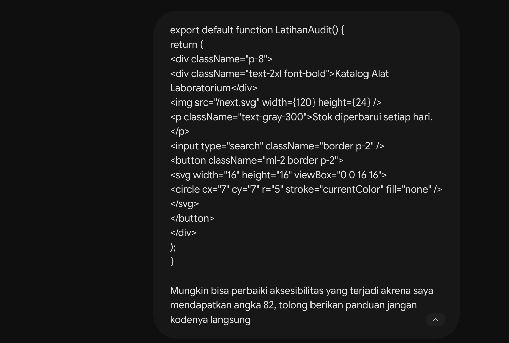
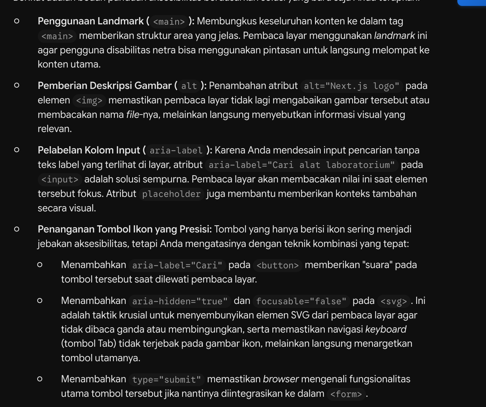